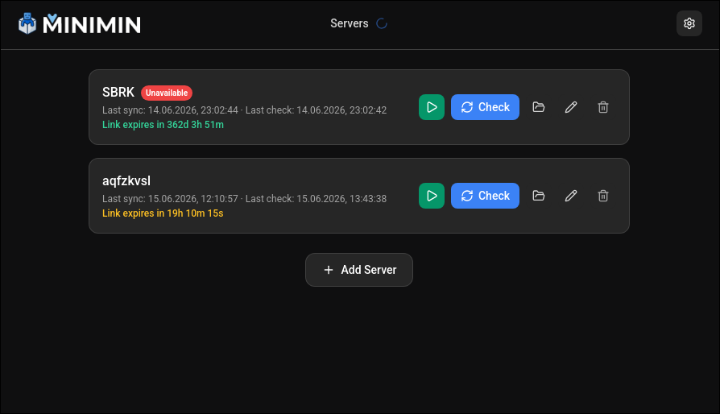
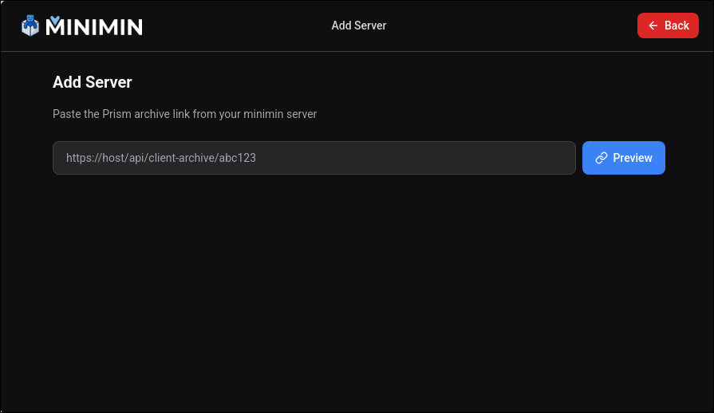
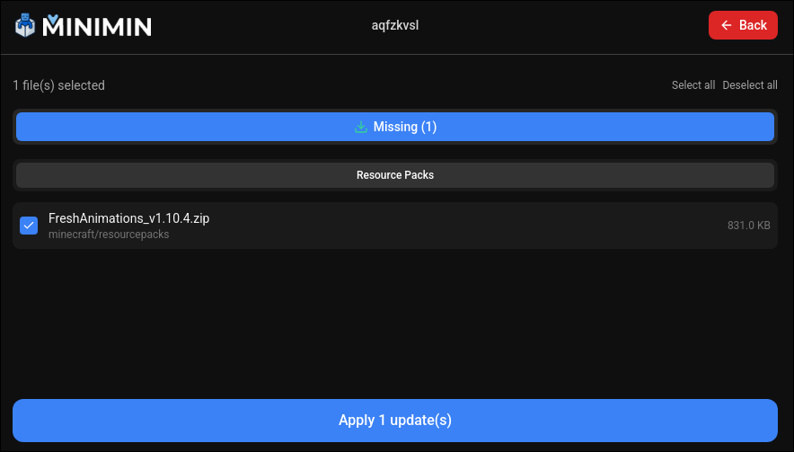
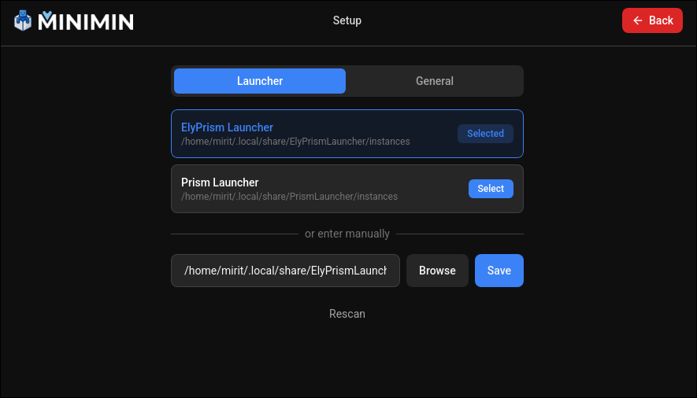

<p align="center">
  
</p>

<p align="center">
  <a href="https://github.com/quonaro/minimin-sync/actions/workflows/build.yml">
    
  </a>
  
  
</p>

# Minimin Sync

A lightweight desktop client for syncing Minecraft modpacks with friends. Works together with [Minimin](https://github.com/quonaro/minimin) — the web-based server panel that generates archive links. Built with [Wails](https://wails.io/) ([GitHub](https://github.com/wailsapp/wails)) — Go + Vue 3 + TailwindCSS.

## What it does

- **Add servers** from a shared archive link — it downloads the modpack and creates a Prism Launcher / MultiMC instance automatically.
- **Check for updates** — compares your local files against the server manifest and reports missing, outdated, or orphaned files.
- **Apply updates** — downloads only changed files, creates a backup, and verifies SHA-256 hashes.
- **Auto-check** — periodically scans your instances in the background and notifies you when updates are available.
- **Launch** — starts the selected instance directly through Prism Launcher, ElyPrismLauncher, or MultiMC.

## Supported launchers

- Prism Launcher
- ElyPrismLauncher
- MultiMC

## Quick start

### Requirements

- Go 1.21+
- Node.js 18+
- Wails CLI (`go install github.com/wailsapp/wails/v2/cmd/wails@v2.12.0`)
- One of the supported launchers installed

### Run in development

```bash
# Install frontend dependencies
cd frontend && npm install && cd ..

# Run the Wails dev server
wails dev
```

### Build

```bash
# Build for your current platform
wails build

# Build for Windows (from Linux/macOS)
wails build -platform windows/amd64
```

The compiled binary will be in `build/bin/`.

### First use

1. Open the app and select your launcher instances directory.
2. Paste a server archive link (from a Minimin server) and click **Add Server**.
3. When updates are available, click **Check Updates** → select files → **Apply Updates**.
4. Click **Play** to launch the instance through your launcher.

## Architecture

- **Backend (`app.go`, `pkg/`)** — Go logic for discovery, sync, disk checks, launcher detection.
- **`pkg/sync/`** — Core sync engine: manifest comparison, delta downloads, extraction, backups.
- **`pkg/discovery/`** — Auto-detects launcher install directories across OSes.
- **Frontend (`frontend/`)** — Vue 3 + Tailwind UI that binds to Go methods via [Wails](https://wails.io/) runtime.

## Screenshots

> Commit screenshots to `docs/screenshots/` (or use GitHub drag-n-drop upload) and replace the paths below.

### Main Window


List of synced servers with update status.

### Add Server


Add server dialog — pasting an archive link from Minimin.

### Update Check


Update check result — missing / outdated / orphaned files list.

### Settings


Settings — launcher path, instances directory, auto-check interval.

## License

Open source. See repository for details.
